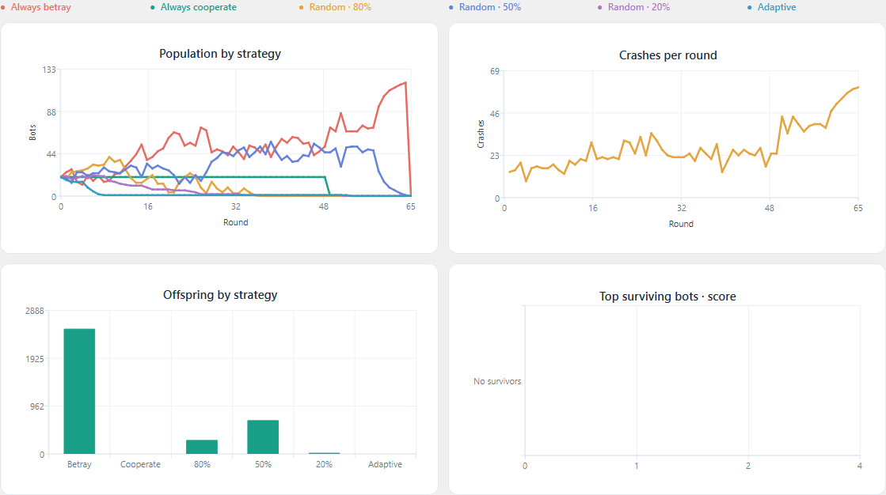

# Bot Society — Desktop version

This is the PySide6 version of the bot simulation. It puts the settings and plots
in one window and saves previous games so they can be checked later.

On Windows, double-click [software.exe](software.exe). Python is included in
the executable, so you do not need to install it separately.

## Starting a game

Open **New game** and enter how many bots you want from each of the six types.
You can leave a type at zero, but the total must be between 2 and 5,000 bots.
The game name is optional.

The round limit starts at **100**. You can change it, along with the starting
score, random seed, and playback speed. Using the same seed and settings gives
the same simulation results.

Below these settings is the payoff table. Each row has the score change for
player A and player B. The checkboxes control death on mutual defiance,
reproduction, replacement of the weakest bot, and stopping when only one strategy
remains. The parent percentage can also be changed.

Click **Start simulation** when the settings are ready. The population, crashes,
offspring, and top-score plots update while the game runs. Use **Pause** and
**Resume** to look at the current state, or **Stop & save** to end the run early.

## Results and history

The final plots stay on screen after the game ends. **Game details** shows the
inputs, final populations, offspring counts, and the round when each strategy
became extinct. **Export plot** saves the four charts together as a PNG.



Completed games and manually stopped games appear in **Game history**.
Double-click a row to reopen its plots and details. Closing the app during a run
also stops and saves that game before exiting.

History is stored locally at:

```text
%LOCALAPPDATA%\BotSociety\BotSociety\history.sqlite3
```

The database contains the settings, round-by-round results, final statistics,
and a PNG of each game's final plots. No account or internet connection is needed.

## Default rules

Bots and their offspring start with 100 points. The default payoffs are:

| Player A | Player B | A's score change | B's score change |
| --- | --- | ---: | ---: |
| Trusting | Trusting | -2 | -2 |
| Trusting | Defiant | -2 | +5 |
| Defiant | Trusting | +5 | -2 |
| Defiant | Defiant | -100 | -100 |

Bots are shuffled into pairs each round. If the population is odd, one bot sits
out. A score of zero or less kills a bot. Mutual defiance also kills both players
regardless of their scores when that checkbox is enabled.

With reproduction enabled, dead bots are replaced by offspring from the
highest-scoring survivors. The default parent pool is the top 10%, rounded down
with at least one parent. If nobody dies, the optional weakest-bot rule replaces
the lowest-scoring bot with an offspring of the strongest one. All offspring
start with the configured starting score.

If all bots die, the game ends. Otherwise, it runs until the round limit or until
one strategy remains, depending on the early-stop setting.

The adaptive bot counts the moves from previous matches and chooses the less
common move. It chooses Defiant when the counts are equal or there is no history.
Both players decide before their match is added to the counts.

The **population leader** is the strategy with the most surviving bots. Ties are
shown together. The top-score chart ranks individual survivors by their scores.

## Working with the source

The entry point for the interface is [app.py](app.py).
[engine.py](engine.py) runs the simulation, [charts.py](charts.py) draws the
plots, [storage.py](storage.py) handles history, and [theme.py](theme.py)
contains the interface styles.

The copies of `main.py`, `Bots.py`, and `game.py` in this folder match the original
files. The GUI uses a separate engine for the configurable rules and fixes the
repeated history counting in the original round loop. The original program is
documented in the [main README](../README.md).

Run the following commands from the **project root**, one level above this folder:

```powershell
python -m pip install -r software/requirements.txt
python software/app.py
```

To build the Windows executable:

```powershell
powershell -ExecutionPolicy Bypass -File software/build.ps1
```

The script uses PyInstaller and writes `software/software.exe`. It also uses the
local packaging dependencies in `.build-deps` if that folder is present. The build
includes Python and the required Qt libraries in one file. Launching it can take
a few seconds while those files are extracted. The executable is not code-signed.

## Tests

From the project root:

```powershell
python -m unittest discover -s software -p "test_*.py" -v
```

The tests cover the simulation rules, repeatable seeds, history storage,
pause/resume, and saving when the window closes.

There is also a short application check that runs a game, saves it, reopens the
results, and writes screenshots:

```powershell
$env:QT_QPA_PLATFORM = 'offscreen'
python software/app.py --smoke-test software/test-artifacts/source
```

It uses a separate test database and writes its result to `smoke-test.json` in
the output folder. The normal game history is left alone. The executable accepts
the same `--smoke-test` option.
