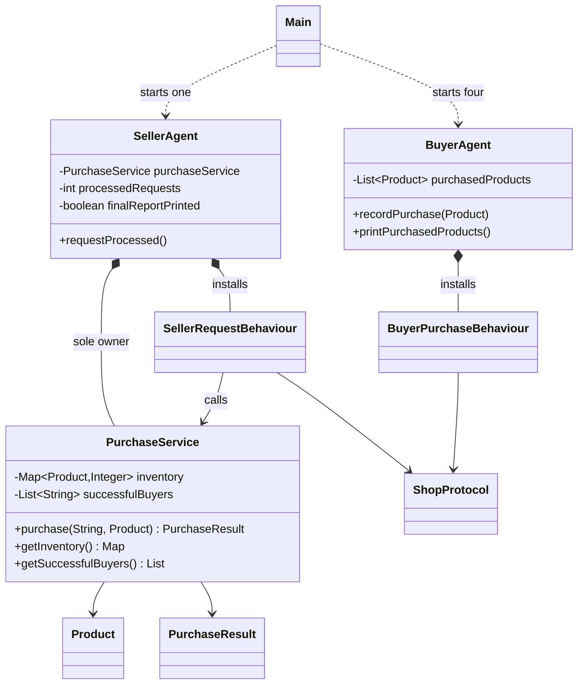
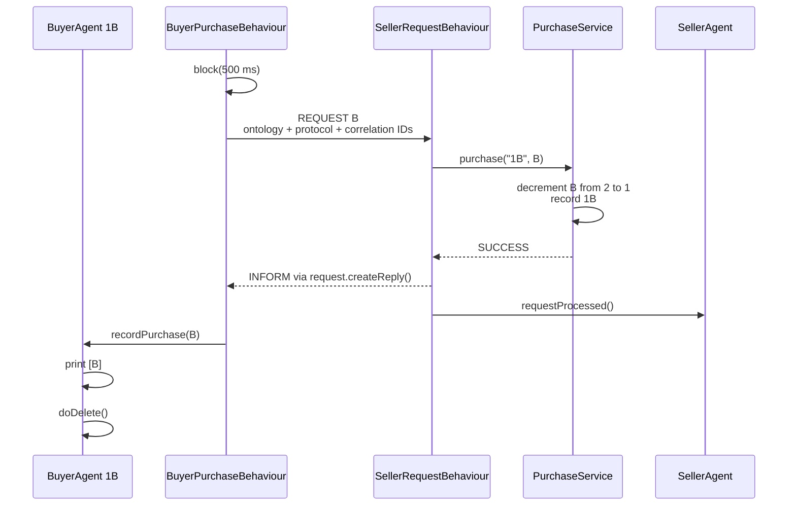
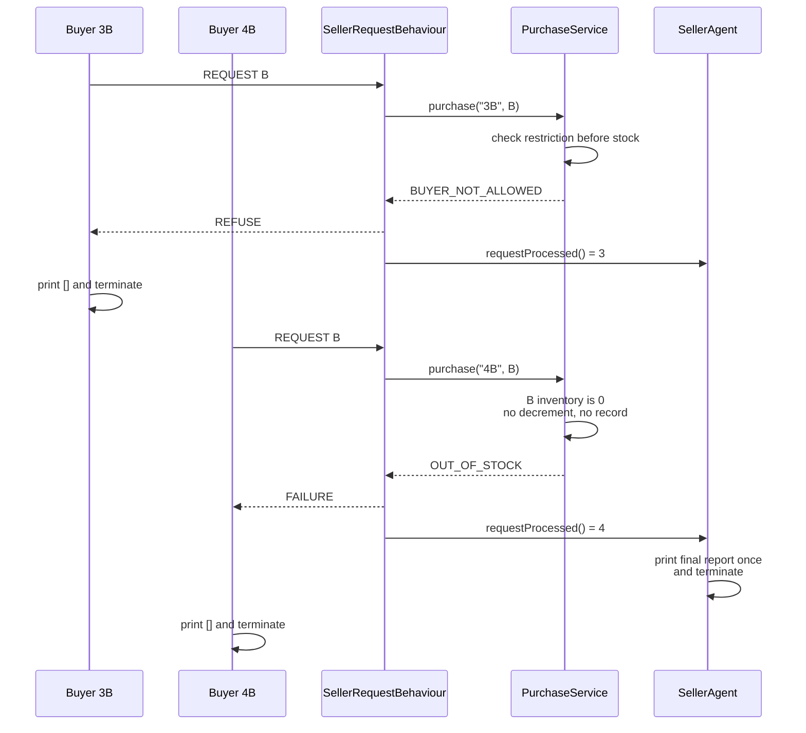

# Multi-Agent Shop Architecture

## Overall architecture

The project separates JADE integration from business logic. `Main` starts the JADE platform and agents. Buyer and seller agents manage their own lifecycles, while behaviours perform asynchronous ACL communication. `PurchaseService` owns the shop rules and inventory operations without importing JADE classes.

The running application contains exactly one `seller` and four buyers: `1B`, `2B`, `3B`, and `4B`. JADE also creates its normal platform-management agents, such as AMS and RMA; these are infrastructure rather than shop agents.

## Class responsibilities

| Class | Responsibility |
|---|---|
| `Main` | Creates the GUI-enabled JADE main container on `127.0.0.1:7778`, then starts the seller and four configured buyers. |
| `SellerAgent` | Owns the single `PurchaseService`, counts processed requests, prints one final report, and terminates after four requests. |
| `BuyerAgent` | Validates startup arguments, owns its purchased-product list, installs its purchase behaviour, and prints lifecycle information. |
| `SellerRequestBehaviour` | Filters purchase requests, parses products, calls `PurchaseService`, maps results to ACL replies, and counts every processed request once. |
| `BuyerPurchaseBehaviour` | Waits for the configured delay, sends exactly one correlated request, handles its reply, prints the result, and terminates the buyer. |
| `PurchaseService` | Applies inventory and buyer-eligibility rules independently of JADE. |
| `Product` | Defines products `A` and `B`. |
| `PurchaseResult` | Defines `SUCCESS`, `BUYER_NOT_ALLOWED`, and `OUT_OF_STOCK`. |
| `ShopProtocol` | Holds shared ontology, protocol, seller-name, and request-count constants. |
| `ScenarioConfiguration` | Selects one immutable deterministic buyer plan from JVM properties and applies the optional initial delay. |
| `BuyerPlan` | Stores one buyer's local name, requested product, and effective delay. |

## Component and class relationships

## Agent lifecycle

1. `Main` creates a JADE main container with the GUI enabled.
2. `seller` starts, creates its `PurchaseService`, and installs a cyclic receiver behaviour.
3. Each buyer validates its product, delay, and seller name, then installs one purchase behaviour.
4. Each buyer waits using `block(delay)`, sends one request, and blocks while waiting for the correlated reply.
5. After a reply, the buyer prints its result and purchase list, then calls `doDelete()`.
6. The seller increments its processed count after every valid or invalid matching request.
7. After four requests, the seller prints the final report exactly once and calls `doDelete()`.
8. Each agent's `takeDown()` prints a shutdown message.

When `mas.gui=false`, the seller schedules a short JADE `WakerBehaviour` after the fourth reply. A named helper thread then asks the actual main-container controller to stop. The helper is necessary because a JADE agent scheduler thread cannot safely tear down the container that is running it. JADE completes its normal shutdown and the JVM exits without killing unrelated Java processes. GUI mode remains enabled by default and does not auto-close RMA.

## Communication protocol

Buyer requests use:

- Performative: `ACLMessage.REQUEST`
- Ontology: `multi-agent-shop`
- Protocol: `fipa-request` (FIPA Request)
- Content: `A` or `B`
- Correlation: unique `conversation-id` and `reply-with`

The seller's `MessageTemplate` requires the request performative, ontology, and protocol. It creates every response with `request.createReply()`, which preserves conversation metadata and sets `in-reply-to` from the request's `reply-with` value.

Seller outcomes are mapped as follows:

| Business result | ACL response |
|---|---|
| `SUCCESS` | `ACLMessage.INFORM` |
| `BUYER_NOT_ALLOWED` | `ACLMessage.REFUSE` |
| `OUT_OF_STOCK` | `ACLMessage.FAILURE` |
| Invalid product content | `ACLMessage.FAILURE` |

## Inventory ownership

`SellerAgent` creates and owns the only `PurchaseService` used at runtime. The mutable inventory and successful-buyer list exist only inside that service. Buyers never receive a service reference and cannot update inventory. Public collection getters return immutable copies, so external callers cannot mutate internal state.

The special `3B` rule is evaluated before stock availability. Inventory is decremented and the buyer is recorded only on success, so refusals, failures, and repeated out-of-stock attempts cannot make inventory negative.

## Why `PurchaseService` is independent of JADE

Keeping JADE types out of `PurchaseService` makes the business rules deterministic and fast to unit-test without starting an agent platform. It also gives the presentation a clear boundary: behaviours translate ACL messages into domain inputs and translate `PurchaseResult` back into ACL performatives, while the service decides whether a purchase is allowed.

## Successful purchase sequence

## Refusal and out-of-stock sequences

