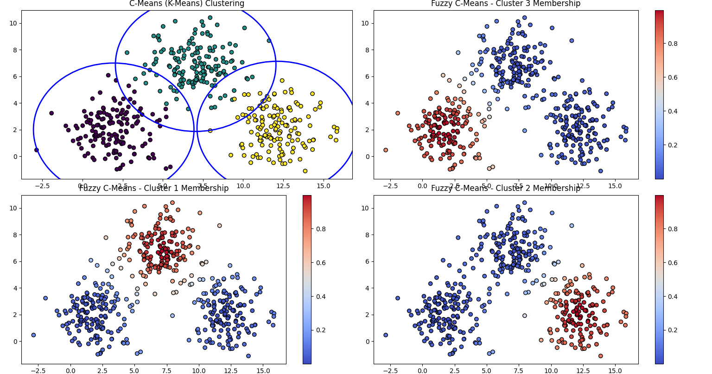
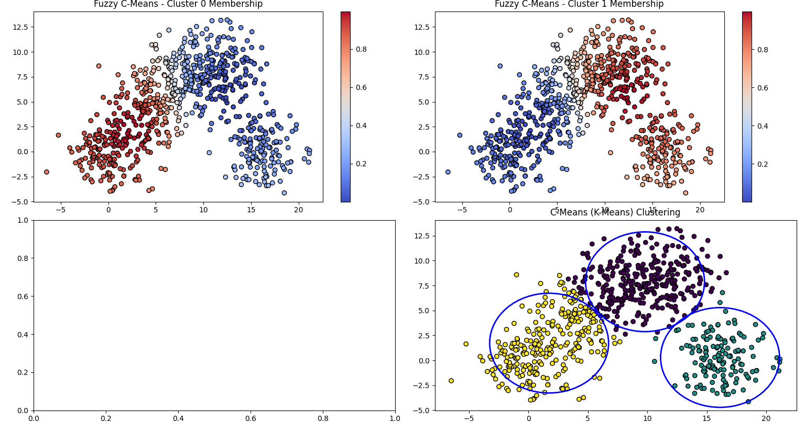

# FCM and c-means

---

<b>This file is for educational purpose</b>

<i>Whole data is generated.</i>

### data_1

It has less shared data between clusters and we guess the behavior between two algorithms be the same!

as we see below.

### data_2

Here our data is over shared so we expect that the conclusion of two algorithms are not the same!

as we see below.

---

## Logic

At first, we should find the best number of cluster in our data so as you can see in both pictures in data_2 our FCM algorithm detected two main clusters, but c-means find three!

also for FCM, we decided to show the membership function that our classmates can realize the difference between FCM and c-means better.

Finally, I think its a good example for educational goals to differ the behavior of how two algorithms function.

<b>Thank you for your consideration.✌️🫡
