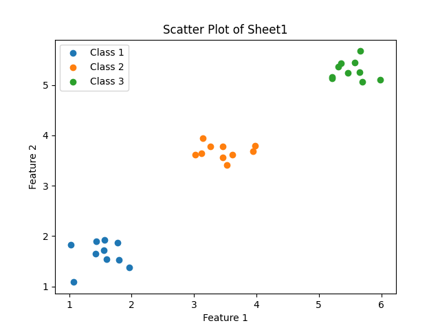

# Linear and non-linear problem

---

What's the difference!

Here, our problem has 2 feature and 3 different classes(labels).

here we show the scatter plot for knowing better

Here we have a exel file(.xlsx) which has created data(artifitial data)

### scatter plot.py

in this code, we try to draw the scatter plot from the .xlsx file

## Linear

As scatter plot shows we can divide our classes with a line (one line) which they don't have any common between them

## Non-linear

here scatter plot illustrates that each class has vary data which can not be divide by one line so we called them non-linear problems!

